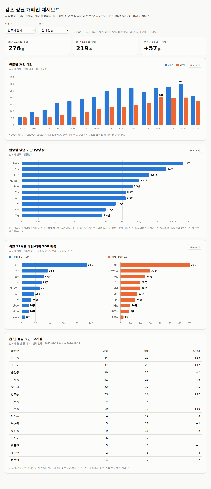

# 김포 상권 개폐업 대시보드

지방행정 인허가 데이터로 **김포시 음식점의 개업·폐업 추이**를 읍·면·동, 업종별로 보여주는 Spring Boot 웹 서비스입니다.
"우리 동네 카페는 순증가, 치킨집은 순감소" 같은 흐름과, 업종별로 보통 몇 년 버티는지를 한눈에 볼 수 있어요.



> ⚠️ 위 화면과 `sample-data/` 는 **개발·시연용 가짜 데이터**입니다. 실제 김포시 통계가 아닙니다.
> 모든 지표는 공공데이터에 기록된 값 기준의 **추정치**이며, 폐업 신고 누락·지연이 있을 수 있습니다.

## 빠른 시작

필요한 것: **JDK 21 이상** (21, 25에서 테스트 확인). Gradle은 `./gradlew` 가 알아서 받고, DB 설치도 필요 없어요.

```bash
./gradlew bootRun          # macOS / Linux / Git Bash   (Windows cmd: gradlew bootRun, PowerShell: .\gradlew bootRun)
```

서버가 뜨면 **http://localhost:8081** 에 접속해서 **[샘플 데이터 불러오기]** 버튼을 누르세요. 가짜 데이터 3,600건이 적재되고 화면이 채워집니다.
터미널 인수나 따옴표 없이 되기 때문에 처음에는 이 방법을 권해요. (DB가 비어 있을 때만 동작해서, 실제 데이터에 가짜 데이터가 섞이지 않아요.)

> 서버는 **한 번에 하나만** 실행하세요. 같은 DB 파일(`data/`)을 두 개가 동시에 열 수 없어서, IntelliJ에서 실행 중인데 터미널에서 또 `bootRun` 하면 `Database may be already in use` 로 죽습니다.

**IntelliJ 에서 실행하기**

1. Settings → Build, Execution, Deployment → Build Tools → Gradle → **Gradle JVM** 을 JDK 21 이상으로 고르고, Gradle 창에서 *Reload All Gradle Projects* 를 누릅니다.
2. `GimpoBizDashboardApplication` 을 실행하고 브라우저에서 위 버튼을 누르면 끝이에요. 프로그램 인수는 필요 없습니다.

적재한 데이터는 `./data/` 의 H2 파일 DB에 남아서, 다음 실행부터는 바로 화면이 뜹니다.
처음부터 다시 하고 싶으면 서버를 끄고 `data/` 폴더를 지우세요.

### 실제 김포 데이터로 돌리기

1. 지방행정 인허가 데이터(공공데이터포털 또는 지방행정 인허가 데이터개방)에서 김포시 CSV를 받아 **`import/` 폴더에 넣습니다.** 업종이 다른 파일을 여러 개 넣어도 돼요.
2. 서버를 (다시) 실행하면 **시작할 때 `import/` 의 `*.csv` 가 자동으로 적재**됩니다. 실행 인수는 필요 없어요.
   - 같은 파일을 다시 넣어도 중복 없이 갱신됩니다. CP949/UTF-8 인코딩은 자동으로 구분해요.
   - 주소에 `김포시` 가 없는 행은 걸러냅니다 (`app.import.region-keyword`).
   - 컬럼명이 달라 읽지 못하면 어떤 컬럼을 못 찾았는지 에러로 알려줘요. 별칭은 `importer/CsvRowParser.java` 상단에 추가하세요.
3. 샘플 데이터를 불러온 적이 있다면 **서버를 끄고 `data/` 폴더를 지운 뒤** 실행하세요. 안 지우면 가짜와 실제 데이터가 섞여요.

김포시 일반음식점 CSV(15,069행)로 검증했어요. 참고할 점 두 가지:

- 일반음식점 파일에는 **휴게음식점(카페·제과점 등)이 없어서** 카페 통계가 모자랍니다. 보려면 휴게음식점 CSV도 `import/` 에 넣으세요.
- 원본의 `기타` 업종이 최근 신규 인허가의 약 1/3이라 **업종별 추세는 왜곡될 수 있어요.** 화면의 TOP 업종 카드가 이 경우 주석으로 알려줍니다.

## 문제 해결

| 증상 | 해결 |
|---|---|
| Gradle 동기화가 "호환되지 않는 Java" 로 실패 | Gradle JVM 을 JDK 21 이상으로 지정 (위 IntelliJ 설정 참고). Gradle 래퍼는 9.8.0 이라 JDK 25 까지 지원합니다. |
| IntelliJ 로 실행하면 `NoClassDefFoundError: com/fasterxml/classmate/TypeResolver` | 최신 코드를 받고 *Reload All Gradle Projects* 후 다시 실행하세요. 그래도 나면 터미널에서 `gradlew bootRun --args="..."` 로 실행하세요. (Gradle 이 직접 클래스패스를 만들어서 영향이 없어요.) |
| 위 오류가 계속될 때 확인 | File → Project Structure → Libraries 에 `classmate` 가 있는지, 빨갛게 깨져 있지는 않은지 봅니다. 깨져 있으면 `~/.gradle/caches/modules-2/files-2.1/com.fasterxml/classmate` 폴더를 지우고 `gradlew build --refresh-dependencies` 후 다시 Reload 하세요. |
| `Database may be already in use ... The file is locked` | 이 앱이 **이미 실행 중**이라는 뜻이에요. IntelliJ 실행 창(■ 정지)이나 이미 띄운 터미널을 먼저 종료하고 다시 실행하세요. 한 번에 하나만 실행할 수 있어요. |
| `Port 8081 was already in use` | 기본 포트는 8081 입니다. 다른 앱과 겹치면 프로그램 인수에 `--server.port=9090` 을 추가하세요. 누가 쓰는지는 `netstat -ano \| findstr :8081` 로 PID 를 찾아 확인합니다. |

## 기능

| 카드 | 내용 |
|---|---|
| 요약 | 최근 12개월 개업·폐업·순증감 |
| 연도별 개업·폐업 | 최근 15년 막대 그래프. 동네·업종 필터 적용 |
| 업종별 영업 기간 | 폐업한 곳의 인허가일→폐업일 중앙값(평균은 툴팁). 표본 10곳 미만 업종 제외 |
| 최근 12개월 TOP 업종 | 개업·폐업 상위 10개 업종 |
| 읍·면·동별 비교 | 신도시와 구도심의 개업·폐업·순증감 |

모든 차트에는 **표로 보기** 가 있고, 라이트/다크 모드와 모바일 폭을 지원합니다.

## API

| 엔드포인트 | 설명 |
|---|---|
| `GET /api/meta` | 적재 건수, 기준일, 읍면동·업종 목록(필터용) |
| `GET /api/trend?district=&category=&years=15` | 연도별 개업·폐업·순증감 |
| `GET /api/survival?district=&minSample=10&limit=12` | 업종별 영업 기간 (평균·중앙값) |
| `GET /api/ranking?district=&months=12&limit=10` | 최근 N개월 개업·폐업 TOP 업종과 합계 |
| `GET /api/districts?category=&months=12` | 읍·면·동별 최근 N개월 개업·폐업 |

`district`, `category` 를 비우면 전체입니다.

## 설계 메모

- **기준일은 오늘이 아니라 데이터의 마지막 날짜(`asOf`)** 입니다. 내려받은 CSV가 한두 달 묵었어도 "최근 12개월"이 비지 않게 하려는 선택이에요. 미래 날짜 오타는 오늘로 잘라냅니다.
- **영업 기간 지표에는 편향이 있어요.** 폐업한 곳만 계산하므로 아직 영업 중인 오래된 가게가 빠져 실제 수명보다 짧게 나옵니다. 업종끼리 비교하는 상대 지표로 읽도록 화면에도 적어 두었습니다. 다음 단계로 "개업 후 3년 생존율"처럼 아직 영업 중인 곳까지 반영하는 지표를 추가할 수 있어요.
- **적재는 멱등합니다.** `개방서비스명 + 관리번호` 를 키로 upsert 하며, 관리번호가 없는 파일은 `사업장명 + 주소 + 인허가일` 로 대신합니다.
- **읍·면·동은 지번 주소에서 추출**합니다. 도로명 주소만 있는 행은 `미상` 으로 분류해 표에 그대로 드러냅니다.
- 집계는 `GROUP BY 연도 / 업종 / 읍면동` JPQL 쿼리이고 (`domain/BusinessRepository.java`), 선택 필터는 `null` 대신 빈 문자열 센티널로 받아 DB에 상관없이 동작하게 했습니다.
- 집계 테스트는 `src/test/resources/test-businesses.csv` 의 **손으로 계산한 정답**과 비교합니다.
- Chart.js 는 CDN 없이 `static/vendor/` 에 포함해 오프라인에서도 동작합니다. 화면의 동적 문자열은 전부 `textContent` 로만 넣습니다.

## 프로젝트 구조

```
src/main/java/com/gimpo/bizdash
├── domain/    Business 엔티티, BusinessRepository(집계 쿼리)
├── importer/  CSV 적재: 인코딩 판별, 헤더 별칭, 주소·날짜·업종 정제, upsert
├── stats/     StatsService: 추이·영업 기간·랭킹·읍면동 비교
└── web/       StatsController (REST)
src/main/resources/static/   index.html · app.css · app.js · vendor/chart.umd.js
sample-data/                 가짜 샘플 CSV  (scripts/generate_sample_data.py 로 재생성)
```

## 테스트·빌드

```bash
./gradlew test       # 23개: 주소/날짜 파서, 적재(CP949·BOM·멱등), 집계 API
./gradlew bootJar    # build/libs/ 에 실행 가능한 jar
```

## 다음 단계 아이디어

- 휴게음식점·미용·학원 등 업종 확장 (파일만 추가하면 적재됨)
- 아직 영업 중인 곳까지 반영한 N년 생존율, 폐업률 높은 업종 랭킹
- 좌표(X/Y)로 지도 히트맵, "폐업률 높은 골목"
- H2 → MySQL/PostgreSQL 전환, Flyway 마이그레이션, 배포
